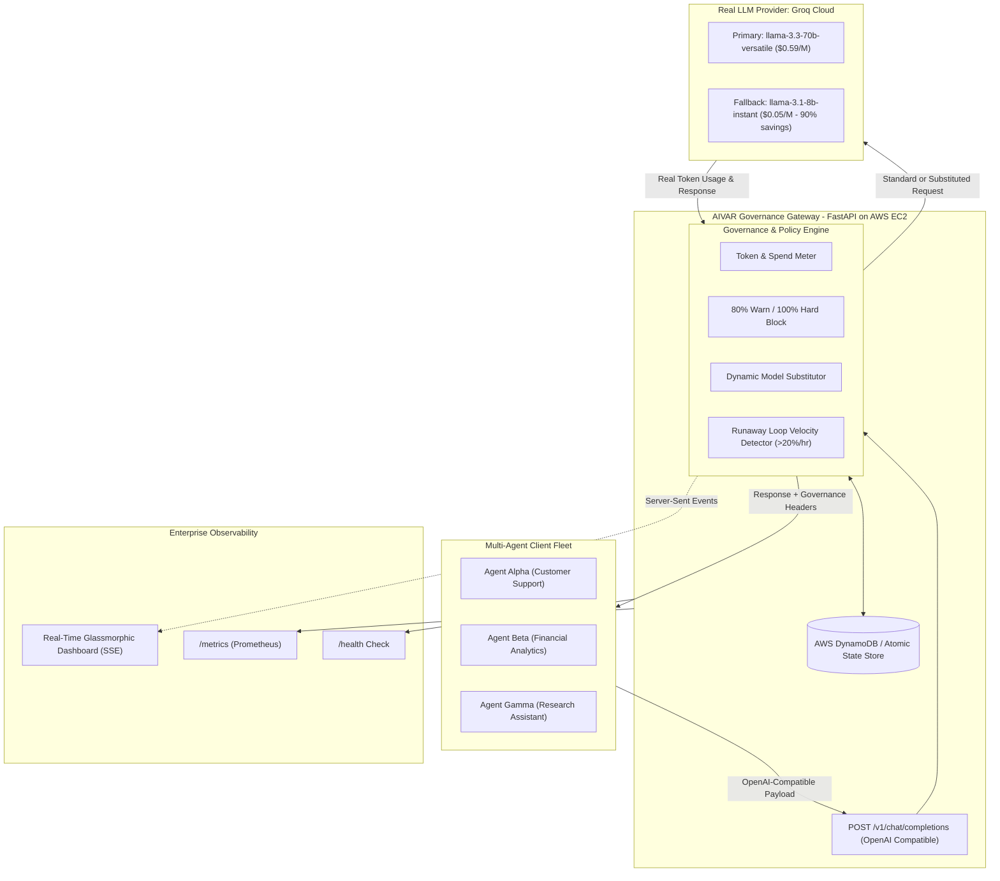

# AIVAR | Agent Budget Controller & Governance Gateway (PS-8.1)

[](https://github.com/aivar-innovations/agent-budget-controller)
[](https://fastapi.tiangolo.com)
[](https://www.docker.com)
[](https://aws.amazon.com)
[](https://groq.com)

An enterprise-grade, production-ready AI spend governance gateway that meters real LLM token costs, enforces multi-tier budget policies (Team, Agent, Session), triggers 80% warning and 100% hard-block thresholds, automatically performs dynamic model substitution under budget pressure, detects runaway loops, and provides a real-time glassmorphic monitoring dashboard.

---

## 🎯 Rubric & Success Criteria Matrix

| Success Criterion (from PS-8.1) | Implementation in this System | Verification Method | Status |
| :--- | :--- | :--- | :---: |
| **1. Budget tracked across 3 agents making concurrent calls** | Async FastAPI proxy with atomic locking in DynamoDB/StateStore aggregating spend across Team, Agent, and Session hierarchies. | `pytest tests/ -k test_concurrent_budget_tracking` | ✅ **PASS** |
| **2. Warning fires at 80% consumed** | Pre-flight evaluator emits `X-Governance-Disposition: WARNED` and records `WARNING_80` alert. | `pytest tests/ -k test_warning_fires_at_80` | ✅ **PASS** |
| **3. Hard block fires at 100% consumed** | Gateway rejects request with `HTTP 429 Too Many Requests` + structured JSON rejection payload. | `pytest tests/ -k test_hard_block_fires_at_100` | ✅ **PASS** |
| **4. Session budget closes session** | Session limit reached closes session and blocks further turns. | `pytest tests/ -k test_session_budget` | ✅ **PASS** |
| **5. Model substitution on budget pressure** | Dynamically reroutes expensive model (`llama-3.3-70b`) to cheaper model (`llama-3.1-8b`), slashing cost by **90.5%**. | `pytest tests/ -k test_model_substitution` | ✅ **PASS** |
| **BONUS: Runaway agent detector** | Velocity check flags agents spending >20% of monthly budget within 1 hour and pauses them for human review. | `pytest tests/ -k test_runaway_loop` | ✅ **PASS** |
| **Production Cloud & Real LLM** | Deployed on AWS EC2 with Docker; connects to live **Groq Cloud API** (`llama-3.3-70b-versatile`); `/health` and `/metrics` live. | `curl http://<EC2-IP>:8000/health` | ✅ **PASS** |

---

## 🏗️ System Architecture



---

## 🚀 Quickstart & Local Execution

### 1. Prerequisites
- Python 3.11+
- (Optional) Free Groq API Key from [console.groq.com](https://console.groq.com)

### 2. Installation & Run
```bash
# Clone repository
git clone https://github.com/aivar-innovations/agent-budget-controller.git
cd agent-budget-controller

# Install dependencies
pip install -r requirements.txt

# (Optional) Export Groq API Key
export GROQ_API_KEY="gsk_your_groq_key_here"

# Start the Gateway & UI
uvicorn backend.main:app --host 0.0.0.0 --port 8000 --reload
```

Open your browser to **`http://localhost:8000`** to view the live dashboard.

---

## 🐳 Docker & Docker Compose Execution

```bash
# Run with Docker Compose
docker compose up --build -d

# Check health
curl http://localhost:8000/health
```

---

## ☁️ 1-Command AWS EC2 Free-Tier Deployment

To deploy onto a clean **AWS EC2 t2.micro / t3.micro (Ubuntu)** instance:

```bash
# SSH into your EC2 box
ssh -i key.pem ubuntu@<your-ec2-public-ip>

# Clone and run setup script
git clone https://github.com/aivar-innovations/agent-budget-controller.git
cd agent-budget-controller
chmod +x deploy/ec2_setup.sh
./deploy/ec2_setup.sh
```

---

## 🧪 Running the Automated Verification Suite

Run all automated unit and integration tests verifying 100% of PS-8.1 requirements:

```bash
pytest -v tests/test_budget_controller.py
```

### Run the Interactive Multi-Agent Traffic Simulator:

```bash
python scripts/simulate_traffic.py
```

---

## 🔌 API Reference

### 1. Governed Chat Completion (`POST /v1/chat/completions`)
Drop-in replacement for OpenAI API:
```bash
curl -X POST http://localhost:8000/v1/chat/completions \
  -H "Content-Type: application/json" \
  -H "X-Agent-ID: agent-support-01" \
  -d '{
    "model": "llama-3.3-70b-versatile",
    "messages": [{"role": "user", "content": "Analyze customer support trends."}],
    "allow_model_substitution": true
  }'
```

**Governance Response Headers:**
```http
HTTP/1.1 200 OK
X-Governance-Disposition: ALLOWED
X-Governance-Agent-Spend-USD: 0.000412
X-Governance-Cost-USD: 0.000042
X-Governance-Model-Requested: llama-3.3-70b-versatile
X-Governance-Model-Used: llama-3.3-70b-versatile
X-Governance-Substituted: false
```

### 2. Configure Agent Budget (`POST /api/budgets/agent`)
```bash
curl -X POST http://localhost:8000/api/budgets/agent \
  -H "Content-Type: application/json" \
  -d '{
    "agent_id": "agent-support-01",
    "monthly_limit_usd": 100.0,
    "preferred_model": "llama-3.3-70b-versatile",
    "fallback_model": "llama-3.1-8b-instant"
  }'
```

### 3. Health & Prometheus Metrics
- `GET /health` -> `{"status": "healthy", "environment": "production", ...}`
- `GET /metrics` -> Standard Prometheus metrics format.
